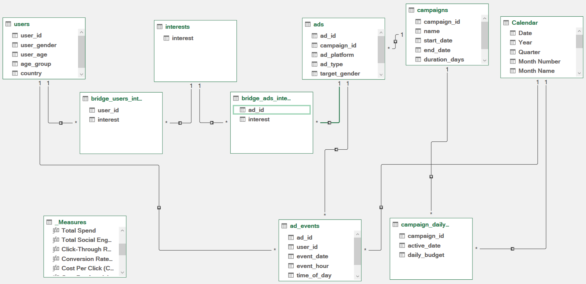
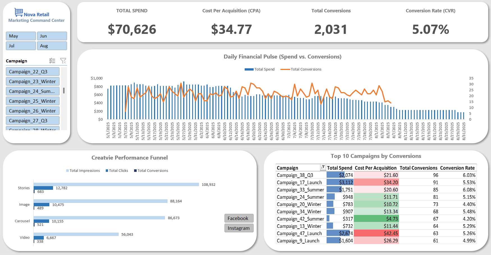

# Nova Retail | Marketing Command Center

## Project Overview
An interactive, single-pane-of-glass Excel application designed to monitor marketing financial performance, track creative pipeline efficiency, and isolate high-converting campaigns. Built entirely using native Excel features (Power Query, Power Pivot, DAX, and Advanced UI techniques), this dashboard acts as a standalone software tool for marketing executives.

## The Business Problem
Marketing directors frequently struggle with fragmented data. Budgets live in financial tables, while clicks and conversions live in platform-specific ad servers. This project bridges that gap, allowing stakeholders to answer three critical questions instantly:
1. **Macro:** How much are we spending, and what is our true Cost Per Acquisition (CPA)?
2. **Micro:** Where are users dropping off in the creative pipeline?
3. **Action:** Which specific campaigns should we scale, and which should we kill?

## Data Architecture & Engineering
This dashboard is powered by a custom **Constellation Schema**, engineered to handle multiple fact tables with differing granularities and complex entity relationships.

* **ETL & Data Cleaning (Power Query):** Extracted and transformed raw CSV files, executing strict de-duplication protocols on the `users` dimension table to ensure 100% referential integrity.
* **Database Normalization:** Resolved complex many-to-many relationships by actively normalizing the `users` and `ads` tables. Deployed custom bridge tables to systematically handle multi-value arrays within the `interests` and `target_interests` columns.
* **Granularity Alignment:** Solved a standard BI granularity mismatch by mathematically distributing flat campaign budgets into a dynamic `campaign_daily_spend` fact table, perfectly aligning the financial data with the daily reporting granularity of the `ad_events` table.
* **DAX & Dynamic Aggregations:** Authored a comprehensive suite of DAX measures for core financials (Spend, CPA, CVR) and pipeline tracking (Impressions, Clicks, Conversions). Engineered robust error handling using the `DIVIDE()` function to gracefully manage zero-spend data anomalies across multidimensional filter contexts.

## UI/UX Design & Dashboard Features
Designed with strict "Card UI" principles and an F-pattern visual hierarchy to reduce cognitive load and prevent "chart clutter."

* **UI Firewalls:** Engineered a multi-tiered interaction model to protect data integrity:
    * *Global (Month Slicer):* Synchronizes the time window across the entire command center.
    * *Cross-Filtered (Campaign Slicer):* Isolates specific financials across KPIs and charts, but is explicitly firewalled from the Leaderboard to preserve Top 10 rankings.
    * *Local (Ad Platform Slicer):* Exclusively controls the Creative Funnel, preventing accidental distortion of the global executive KPIs.
* **Executive KPI Ribbon:** A locked top-row summary of core metrics (Spend, CPA, Conversions, CVR).
* **Daily Financial Pulse (Combo Chart):** A daily time-series analysis mapping raw Spend (bars) against Conversions (line) to expose pacing and weekend dips without hierarchy grouping.
* **Creative Performance Funnel:** A localized view of the customer journey (Impressions > Clicks > Conversions) broken down by Ad Type (Carousel, Video, Image, Stories).
* **Campaign Leaderboard Matrix:** A dynamic, rank-ordered matrix filtered to the Top 10 campaigns by Total Conversions. Features conditional data bars for Spend volume and a Green-White-Red color scale for CPA efficiency, generated via a Linked Picture feed to protect dashboard column widths.

## Technical Skills Demonstrated
* **Tools:** Microsoft Excel (Advanced), Power Query, Power Pivot
* **Data Modeling:** Constellation Schema, Dimensional Modeling, Relational Architecture, Bridge Tables
* **Analytics:** DAX formulation, Cohort/Campaign Tracking, Performance Marketing Metrics
* **Data Visualization:** UI/UX Design, Conditional Formatting, Linked Images, App Packaging (Grid/Ribbon suppression)

## Appendix: Data Source
The raw dataset used for this project was sourced from Kaggle.
* **Dataset Name:** Social Media Advertisement Performance
* **Author:** Alperen Atik
* **Link:** [View on Kaggle](https://www.kaggle.com/datasets/alperenmyung/social-media-advertisement-performance)
